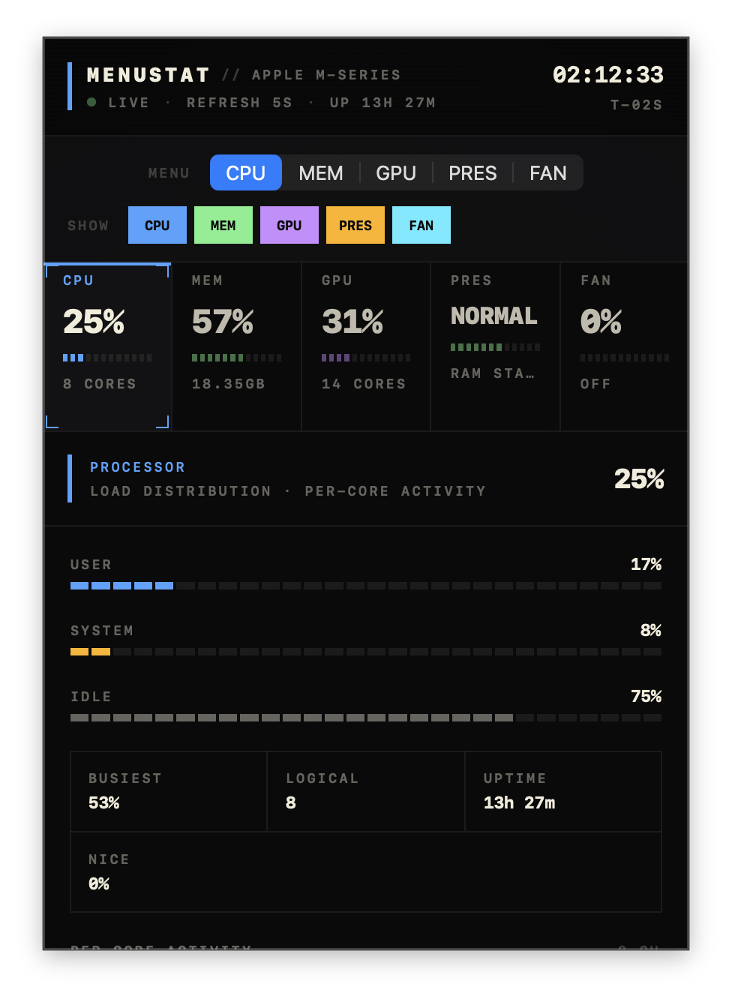

# MenuStat

A lightweight macOS menu-bar system monitor for Apple Silicon — CPU, unified memory, memory pressure, fan RPM, and top-consuming apps, all in a single SwiftUI panel that drops down from your menu bar.

> **Status:** experimental. Built for Apple Silicon (M1+) running macOS 13 Ventura or later. Intel Macs are not supported.

---

## Features

- **CPU** — total load, user / system / idle split, per-core activity, top CPU-consuming processes.
- **Memory** — used / available / active / wired / compressed breakdown of unified memory, plus top memory-consuming processes.
- **Memory pressure** — system pressure gauge (normal / moderate / high) with a heat-proxy "likely culprit" list.
- **Fans** — real-time RPM per fan, normalized range percentage, status bucket (Quiet / Cooling / High) sourced from `AppleSMCKeysEndpoint`. See [fan reading caveats](#fan-reading-caveats).
- **Menu-bar resident** — runs as an `LSUIElement` (no Dock icon, no window).
- **Refreshes every 5 s** — headline metrics stay current; heavier top-app sampling runs when details are visible.

## Screenshots



---

## Requirements

| | |
|---|---|
| OS | macOS 13.0 (Ventura) or later |
| Architecture | Apple Silicon (`arm64`) only |

---

## Install

1. Download the latest release:
   [MenuStat-0.1.5.dmg](https://github.com/adhishthite/menustat/releases/download/v0.1.5/MenuStat-0.1.5.dmg)
2. Open the DMG.
3. Drag `MenuStat.app` into `Applications`.
4. Open `MenuStat.app`.

The app appears as **`MS`** in your menu bar. Click it for the panel; click outside or hit the menu-bar item again to dismiss.

To start MenuStat automatically when you sign in: right-click the menu-bar item → enable **Launch at Login**.

To quit: right-click the menu-bar item → *Quit*.

MenuStat is Developer ID signed and notarized. If macOS asks for confirmation the first time you open it, choose **Open**.

---

## Build from source

Developer requirements:

| | |
|---|---|
| Swift | 5.9+ |
| Xcode CLT | Latest |
| Homebrew | For installing lint / format tools |

```bash
git clone <repo-url> menustat
cd menustat

make install-tools     # one-time: SwiftLint + SwiftFormat via Homebrew
make install-hooks     # one-time: link the pre-commit hook
make run               # build, bundle, sign, launch the menu-bar app
```

For source builds, you can also quit from the terminal with `pkill -x MenuStat`.

---

## Make targets

`make help` prints the full list. The ones you'll actually use:

| Target | What it does |
|---|---|
| `make run` | Build (release), bundle into `MenuStat.app`, codesign locally, launch. |
| `make package-release` | Build, Developer ID sign, optionally notarize, then create DMG and zip release artifacts. |
| `make build` / `make release` | Debug / release build only — no bundle, no launch. |
| `make strict` | Release build with `-warnings-as-errors`. The "type-check + compile" gate. |
| `make test` | Run XCTest unit tests (parallel). |
| `make lint` / `make format` | Run SwiftLint / SwiftFormat. |
| `make fix` | Auto-format **and** auto-fix lint where possible. Run this before commit. |
| `make check` | Full quality gate: format-check + lint + strict build + tests. CI runs this. |
| `make debug` | Launch under `lldb`. |
| `make logs` / `make verify` | Launch and stream `os_log` / sanity-check the process. |
| `make clean` | Remove `.build`, `.swiftpm`, `DerivedData`, and the staged binary. |
| `make install-tools` | Install SwiftLint + SwiftFormat (Homebrew). |
| `make install-hooks` | Symlink `script/pre-commit` into `.git/hooks/`. |

---

## Project layout

```
.
├── Package.swift                    # SPM manifest (executable + test target)
├── Makefile                         # Single entry point for all dev tasks
├── Sources/MenuStat/
│   ├── MenuStatApp.swift            # NSApp delegate, status item, panel wiring
│   ├── MenuStatPanelView.swift      # SwiftUI panel: header, metric tiles, detail layer
│   ├── SystemMonitor.swift          # Pure value types + SystemSampler (Mach/libproc/IOKit)
│   └── SMCFanReader.swift           # AppleSMC IOKit client
├── Tests/MenuStatTests/
│   ├── FanSnapshotTests.swift       # Pure-logic tests for fan status / bucketing
│   └── MemorySnapshotTests.swift    # Memory / CPU / formatter tests
├── script/
│   ├── build_and_run.sh             # Build → bundle → codesign → launch pipeline
│   ├── package_release.sh           # Developer ID signing + notarization packaging
│   └── pre-commit                   # Git hook: format + lint staged Swift files
├── .swiftlint.yml                   # Lint config (strict mode in CI)
├── .swiftformat                     # Format config (4-space, 140-col, sorted imports)
└── .github/workflows/               # GitHub Actions: CI plus signed/notarized release packaging
```

---

## Architecture

MenuStat is a single executable target. The runtime topology:

```
┌────────────────────────────────────────────────────────────────┐
│  NSApplication  (LSUIElement — no Dock, no window)             │
│  └── MenuStatAppDelegate                                       │
│      ├── NSStatusItem  ("MS" in menu bar)                      │
│      ├── MenuStatStatusPanel  (NSPanel, custom)                │
│      │   └── NSHostingController<MenuStatPanelRoot>            │
│      │       └── MenuStatPanelView  (SwiftUI)                  │
│      └── refreshTimer  →  serial sampling queue  every 5 s     │
│                              │                                 │
│                              └── SystemSampler.sample()        │
│                                  ├── host_statistics  (CPU)    │
│                                  ├── host_statistics64  (VM)   │
│                                  ├── libproc  (per-app usage) │
│                                  ├── GPUReader.readGPU()      │
│                                  │   └── cached AGX service +  │
│                                  │       singular IOReg reads  │
│                                  └── SMCFanReader.readFans()  │
│                                      └── cached AppleSMC state │
└────────────────────────────────────────────────────────────────┘
```

**Design notes:**

- The UI never touches IOKit directly — it consumes immutable `SystemSnapshot` value types produced by `SystemSampler`. This is why the unit tests can cover the entire `FanSnapshot` / `MemorySnapshot` / `CPUSnapshot` surface without mocking syscalls.
- Fans, CPU, and memory are sampled on the same 5 s cadence to keep snapshots internally consistent.
- Sampling runs on a serial utility queue. The main thread schedules work, publishes completed snapshots, and skips overlapping ticks; if the panel opens during a hidden-panel sample, a visible app-usage sample is queued next.
- `GPUReader` caches the AGX service after discovery and uses singular IORegistry property reads for `PerformanceStatistics` and static GPU fields, falling back to full properties only when needed. `SMCFanReader` reuses working AppleSMC connections and caches confirmed fanless results so fanless Macs do not keep probing every tick.

---

## Development workflow

```bash
# Edit code, then before committing:
make fix        # auto-format and auto-fix lint
make check      # format-check + lint + strict build + tests
```

The pre-commit hook (`make install-hooks`) runs format + lint on staged `.swift` files only — fast enough you won't be tempted to `--no-verify`.

---

## Release packaging

MenuStat ships outside the Mac App Store as a Developer ID signed and notarized app. The release script uses local environment variables or GitHub Actions configuration for account-specific signing values:

| Setting | Value |
|---|---|
| Bundle ID | `com.adhishthite.MenuStat` |
| Team ID | `TEAM_ID` locally, `APPLE_TEAM_ID` in GitHub Actions |
| Signing identity | `SIGNING_IDENTITY` locally, `DEVELOPER_ID_SIGNING_IDENTITY` in GitHub Actions |
| Minimum macOS | `13.0` |
| Architecture | `arm64` |

Build a signed local release:

```bash
make package-release
```

That creates:

```text
dist/work/MenuStat.app
dist/MenuStat-0.1.0.zip
dist/MenuStat-0.1.0.dmg
```

Published downloads live under GitHub Releases. The GitHub Packages tab is intentionally unused because MenuStat ships as notarized macOS app artifacts, not as a package-registry dependency.

The unsigned/notarization-sensitive values can be overridden:

```bash
MARKETING_VERSION=1.0.0 BUILD_NUMBER=100 make package-release
```

To notarize, first store an Apple notary credential in Keychain. Use an app-specific password for the Apple ID that belongs to the Developer Team:

```bash
xcrun notarytool store-credentials "$NOTARY_PROFILE" \
  --apple-id "YOUR_APPLE_ID_EMAIL" \
  --team-id "$TEAM_ID"
```

Then run:

```bash
TEAM_ID="$TEAM_ID" NOTARY_PROFILE="$NOTARY_PROFILE" make package-release
```

The script submits the app zip to Apple's notary service, staples the notarization ticket to `MenuStat.app`, verifies Gatekeeper assessment, then writes the final distributable zip.

### Adding a new metric

1. Add the value-type fields and any derived computed properties to `SystemMonitor.swift`.
2. Extend `SystemSampler.sample()` to populate them.
3. Add a `MetricSection` case (or extend a detail view) in `MenuStatPanelView.swift`.
4. Add tests for any non-trivial derived properties to `Tests/MenuStatTests/`.
5. `make check`.

### Adding a new lint rule

Edit `.swiftlint.yml` (`opt_in_rules:` for style, `analyzer_rules:` for ones requiring `swiftlint analyze`). Run `make lint` locally. Don't add a rule without first running `make fix` to clear pre-existing violations — strict mode treats every warning as fatal.

---

## Testing

```bash
make test           # parallel, quiet
make test-verbose   # full xctest output
```

Tests live in `Tests/MenuStatTests/` and cover **pure value-type logic only**. They do not exercise `SystemSampler` or `SMCFanReader`, both of which call directly into Mach / IOKit syscalls. Testing those meaningfully would require a dependency-injection refactor (e.g., introducing a `FanReading` protocol that the real reader and a fake both satisfy). See [Roadmap](#roadmap).

---

## Continuous integration

`.github/workflows/ci.yml` runs on every push and pull request to `main`:

1. `make format-check` — fails on any formatting drift.
2. `make lint` — strict mode (warnings = errors).
3. `make strict` — release build with `-warnings-as-errors`.
4. `swift test --parallel`.

SwiftPM artifacts are cached on `Package.resolved` + `Package.swift` hashes. Concurrent runs on the same ref are cancelled.

---

## Fan reading caveats

`SMCFanReader` reads `F0Ac`, `F1Ac`, … from `AppleSMCKeysEndpoint` and `AppleSMC` user-clients via `IOConnectCallStructMethod` (selector 2). Two things worth knowing:

1. **Apple Silicon SMC reports a floor, not an absolute zero.** On M1 Pro / M1 Max machines, `F0Mn` typically returns ~1200 RPM and `F0Ac` may report values at or above that floor even when the physical fan blade is coasting or stopped. The reading is faithful to what SMC publishes — it just isn't a tachometer measurement in the Intel-SMC sense. Cross-check with `sudo powermetrics -n 1 -i 200 --samplers smc | grep -i fan` if in doubt.
2. **No private entitlements required.** `IOServiceOpen` succeeds for unprivileged user processes on Apple Silicon — no `com.apple.private.smc.user-client` needed. This is what enables the app to run codesigned with an ad-hoc identity from `script/build_and_run.sh`.

---

## Roadmap

- [ ] Inject `FanReader` and `Sampler` protocols so end-to-end sampling can be unit-tested with fakes.
- [ ] Persist user preferences (refresh interval, which sections to show, menu-bar title format).
- [x] Optional notarized & signed distribution via a Developer ID certificate.
- [ ] Battery / thermal-state section.
- [ ] Launch-at-login via `SMAppService`.
- [ ] GPU activity (when a public API lands).

---

## Troubleshooting

| Symptom | Likely cause / fix |
|---|---|
| `MS` appears but the panel is blank | Sampler hasn't completed first tick yet. Wait ~5 s, then click again. |
| Fan tile says `Unavailable` | This Mac doesn't expose `FNum` / `F0Ac` over the SMC user-client. Check `MenuStat --probe-fans`. |
| Build fails with "no such module 'AppKit'" | You're not on macOS, or Xcode CLT is missing. Run `xcode-select --install`. |
| `make lint` fails after a fresh clone | Run `make install-tools` first. |
| Commit blocked by pre-commit hook | Run `make fix`, re-stage, commit again. Don't bypass with `--no-verify`. |

For ad-hoc fan diagnostics:

```bash
.build/release/MenuStat --probe-fans
```

This prints raw `FanSnapshot` state to stdout and exits — useful for verifying SMC connectivity without launching the UI.

---

## License

[MIT](LICENSE) © 2026 Adhish Thite.
